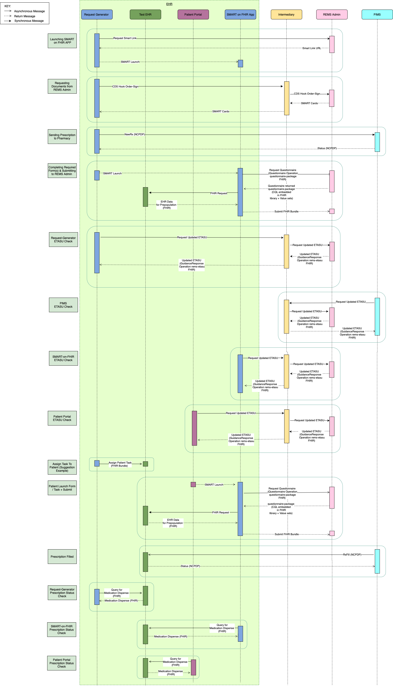

# rems-setup

This repository contains all of the Docker, setup scripts, and documentation for running the entire **REMS Integration Prototype** environment. Use of this repository is recommended for users trying to set up the REMS environment for the first time. 

## REMS Integration Prototype

### Prototype Organization Overview

> For information on the project and how to get involved visit our [CodeX Confluence Page](https://confluence.hl7.org/display/COD/Risk+Evaluation+and+Mitigation+Strategies+%28REMS%29+Integration)

[Prototype Repositories and Capabilities](PrototypeRepositoriesAndCapabilities.md)

### Running the full prototype environment

Complete end-to-end set up guides for the REMS Proof of Concept prototype are listed below:

[Simple Set Up](SimpleSetupGuide.md) - Follow this guide to quickly setup a demo environment for local testing. If you want to make changes or contribute to the codebase, see the detailed developer guide below.

[Docker Developer Setup Guide](DeveloperSetupGuide.md) - Follow this guide to use [Docker](https://docs.docker.com/get-started/overview/) for running REMS Integration Prototype for Local Development.

[Local Developer Setup Guide (No Docker)](EndToEndSetupGuide.md) - Follow this guide to start each application locally **without** using Docker for development.

[HTTPS / SSL Setup Guide](SSLSetupGuide.md) - Follow this guide to launch each application in the prototype workflow with SSL enabled.

## Running end-to-end tests

We use Playwright for end-to-end testing, which automates running the full prototype environment.

1. Install dependencies: `npm install`
2. Run all tests: `npx playwright test` or with the `-ui` flag to view them in the Chromium browser.

## Sequence Diagram 

The following diagram outlines the interactions and communications between each of the components that make up the REMS prototype environment.

# Data Rights

<b>NOTICE</b>

This (software/technical data) was produced for the U. S. Government under Contract Number 75FCMC18D0047/75FCMC23D0004, and is subject to Federal Acquisition Regulation Clause 52.227-14, Rights in Data-General.

No other use other than that granted to the U. S. Government, or to those acting on behalf of the U. S. Government under that Clause is authorized without the express written permission of The MITRE Corporation.

For further information, please contact The MITRE Corporation, Contracts Management Office, 7515 Colshire Drive, McLean, VA 22102-7539, (703) 983-6000.

<b>&copy;2025 The MITRE Corporation.</b>

 

Licensed under the Apache License, Version 2.0 (the "License"); use of this repository is permitted in compliance with the License.
You may obtain a copy of the License at

    http://www.apache.org/licenses/LICENSE-2.0

Unless required by applicable law or agreed to in writing, software
distributed under the License is distributed on an "AS IS" BASIS,
WITHOUT WARRANTIES OR CONDITIONS OF ANY KIND, either express or implied.
See the License for the specific language governing permissions and
limitations under the License.
