# Test Environment Setup

See [Test Environment Usage](TestEnvironmentUsage.md) for details on using the test environment.

The notes here describe one method for launching the Request Generator and REMS SMART on FHIR app. The Request Generator can be launched from within the MELD Sandbox as well as standalone. The REMS SMART on FHIR app can be launched from MELD, standalone, and from Request Generator as described here.

1. Create a MELD account
    - Navigate to [Meld Sandbox](https://meld.interop.community)
    - Select 'Register'
    - Enter your information and select 'Register' again
1. Create a MELD Sandbox

    - Log into MELD

    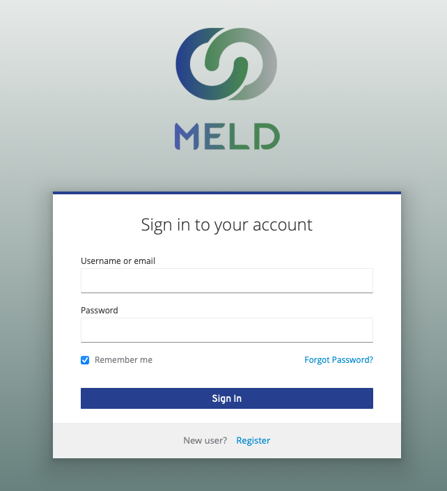

    - Select 'NEW SANDBOX'

    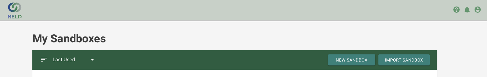

    - Fill out the 'Create Sandbox' Form

    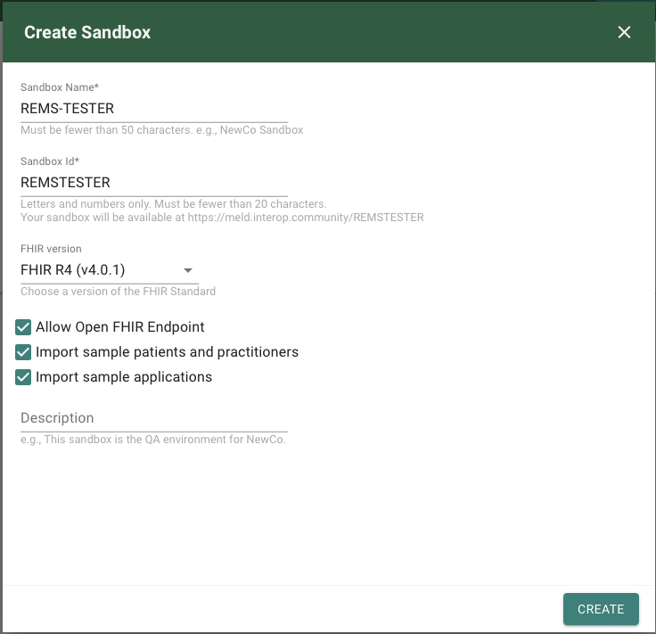

        - Give the Sandbox a Name and an Id (Id will be automatically generated)
        - Select FHIR Version 'FHIR R4 (v4.0.1)
        - Select all of the checkboxes
            - Allow Open FHIR Endpoint
            - Import sample patients and practitioners
            - Import sample applications
1. Import FHIR Resources from test-ehr repository
    - Click settings in MELD in your desired sandbox and select 'Data Manager'
    - Select the 'IMPORT' tab from the top then select 'LOAD FROM FILE'
    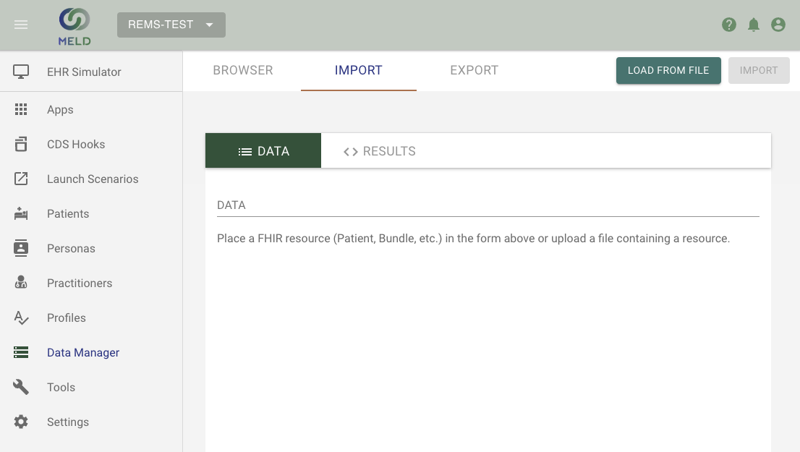
    - Navigate to the folder that the test-ehr is downloaded to and choose the fhirResourcesToLoad folder
    - Individually select and upload each FHIR resource
        - Note: you can skip the rems_smith* files if you only want the Jon Snow Patient
    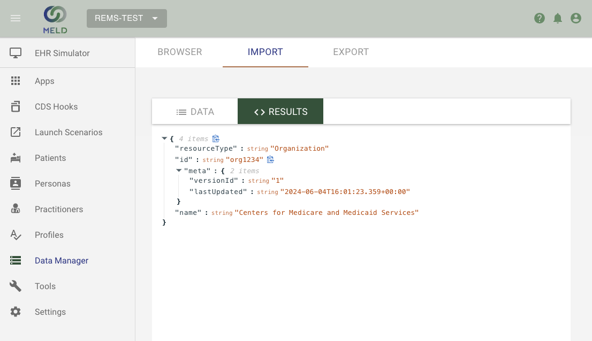
1. Register the REMS SMART on FHIR application
    - Navigate to the 'Apps' section of MELD
    - Select the '+' button at the top right of the page
    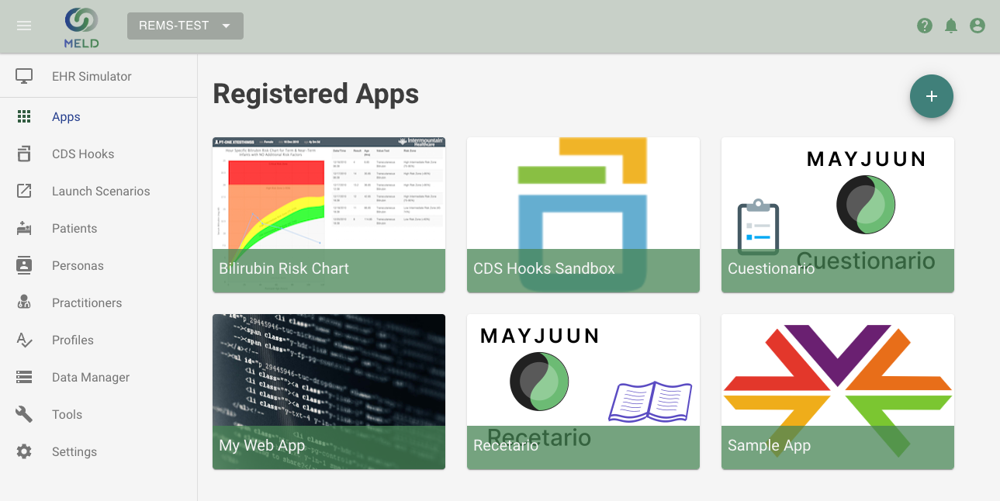
    - Select 'Manually' for how to create the app
    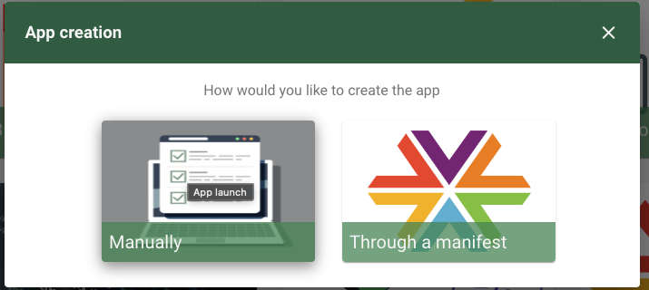
    - Enter the following information into the App Details and leave the rest as default
    
        - App Name: REMS Smart App (Local)
        - App Launch URI: http://localhost:4040/launch
        - App Redirect URIs: http://localhost:4040/index
        - Scopes: patient/Patient.read openid profile user/Patient.read offline_access launch user/Practitioner.read
    - Select save and store the Client ID that is generated and displayed in a pop-up, this will be needed later
    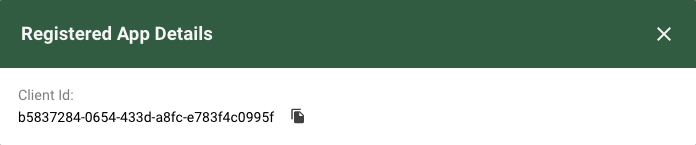
1. Register the Request Generator
    - Complete the steps from the previous section with the following information for the request generator instead
    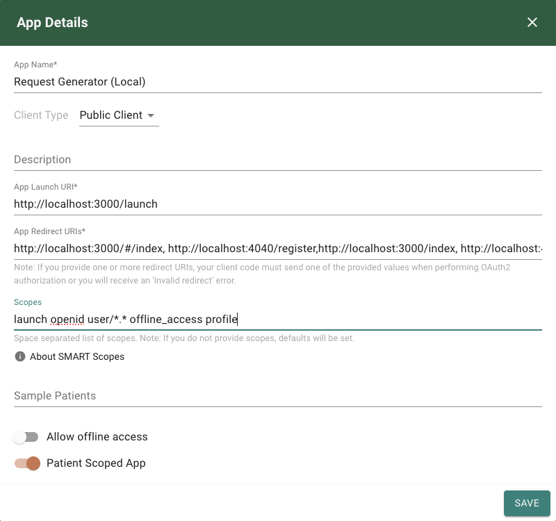
        - App Name: Request Generator (Local)
        - App Launch URI: http://localhost:3000/launch
        - App Redirect URIs: http://localhost:3000/#/index, http://localhost:4040/register,http://localhost:3000/index, http://localhost:4040/index
        - Scopes: launch openid user/*.* offline_access profile
    - Note that the full list of registered applications now includes the Request Generator and the REMS SMART on FHIR app
    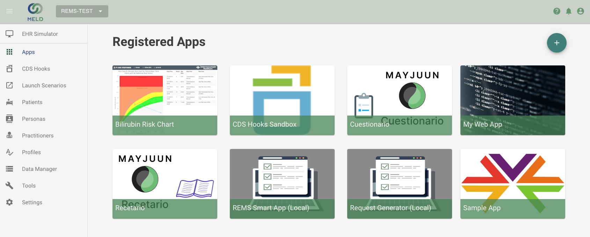
1. Start the REMS Prototype applications:
    - Please refer to the [End to End Setup Guide](EndToEndSetupGuide.md) for running locally, or the [Simple Setup Guide](SimpleSetupGuide.md) for running in docker
    1. MongoDB Server
    1. Request Generator
    1. REMS Admin
    1. PIMS Backend
    1. PIMS Frontend
    1. REMS SMART on FHIR application
    - Note: The following applications are not needed
        - KeyCloak
        - Test EHR
1. Launch the Request Generator
    - Click settings in MELD in your desired sandbox and look for the "Secured FHIR Server URL:"
    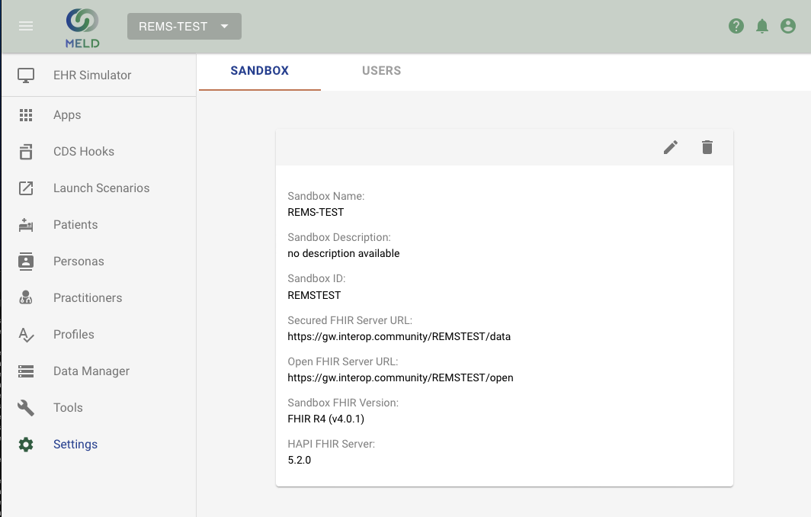
    - Navigation to http://localhost:3000 in your browser
    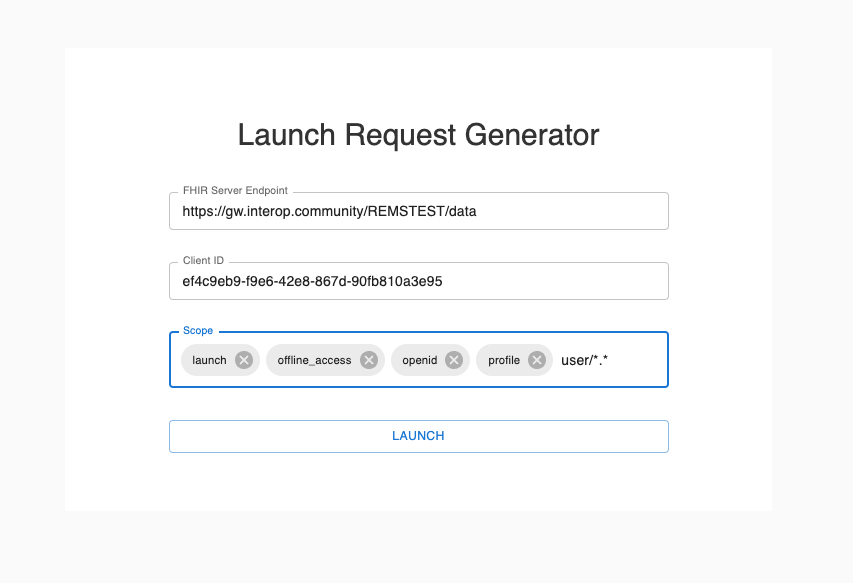
    - Enter the launch details for the MELD Sandbox and select 'LAUNCH'
        - FHIR Server Endpoint: copied from the settings information in the MELD Sandbox (https)
        - Client ID: copied from the Request Generator app registration
        - Scope: same as was used in the app registration
    - Log into MELD using your credentials
    
    - Select 'Authorize' to give the app permission to access the FHIR data within your MELD Sandbox
    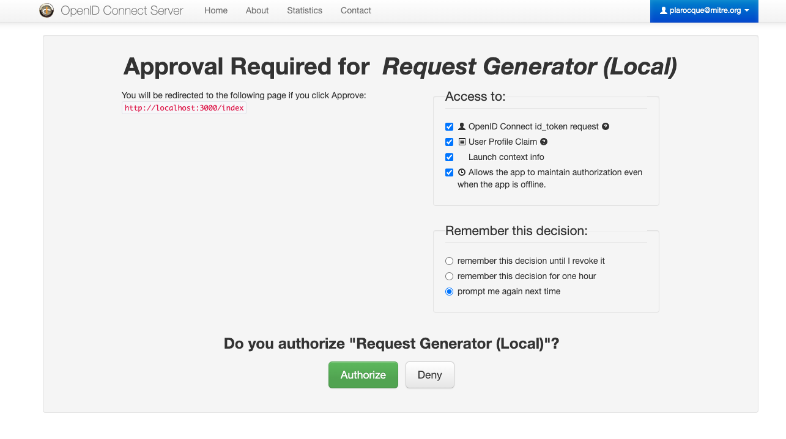
    - Continue using Request Generator as normal with patient Jon Snow
1. Launch the SMART on FHIR App
    - From within the Request Generator, after a patient is selected, click on 'LAUNCH SMART ON FHIR APP'
    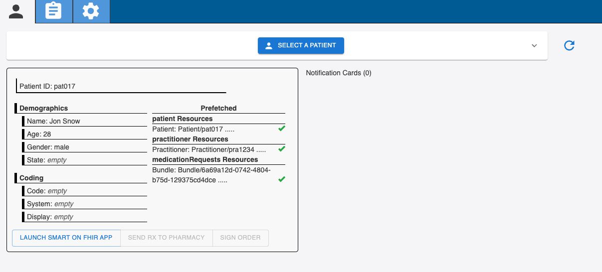
    - The register page will load asking for the Client ID. This is the Client ID that was generated when registering the REMS SMART on FHIR application with the MELD Sandbox.
    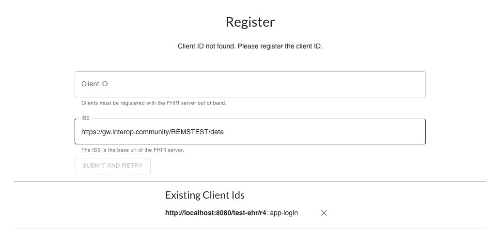
    - Enter the Client ID and select 'SUBMIT AND RETRY'
    - The REMS SMART on FHIR app will now load
