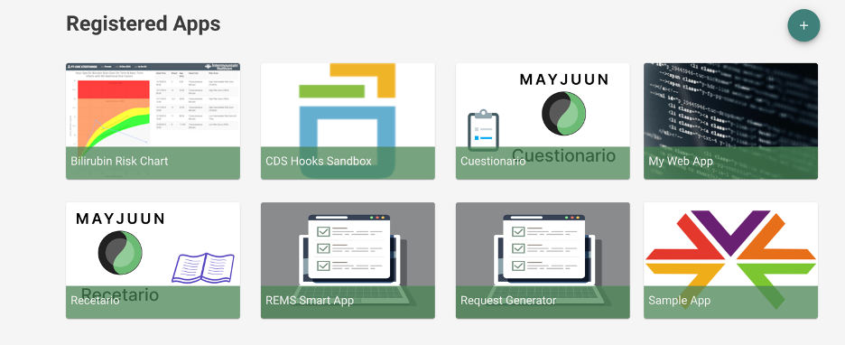
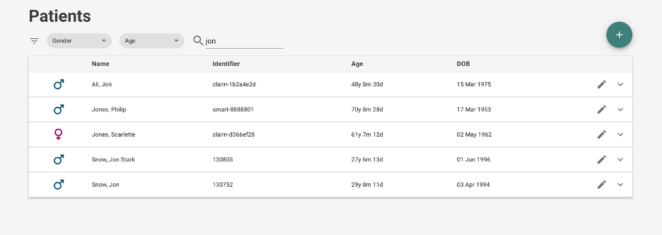
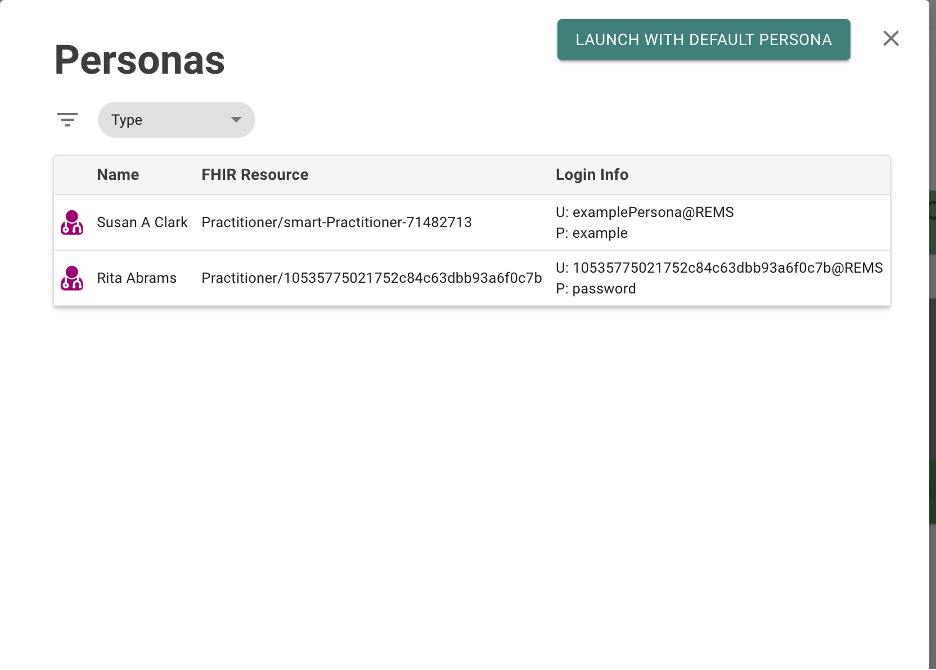
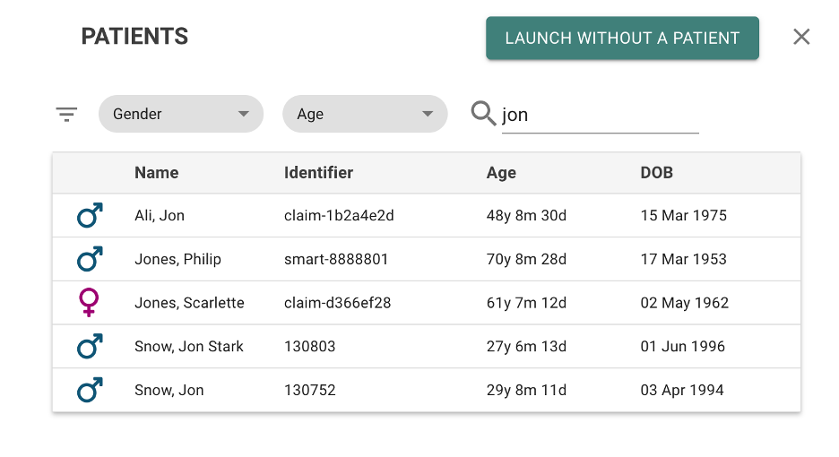
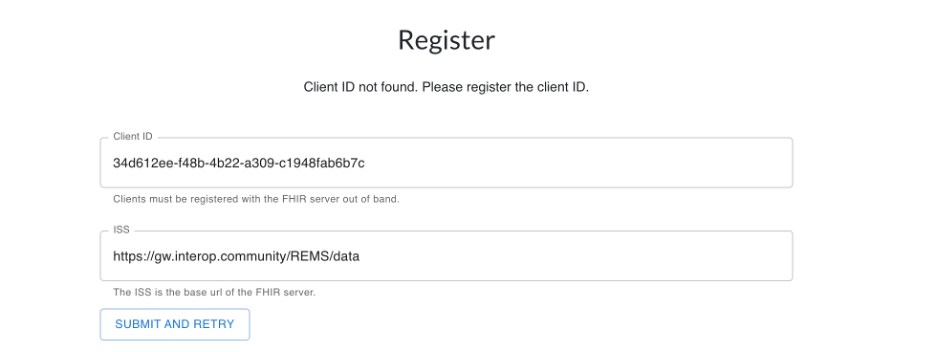
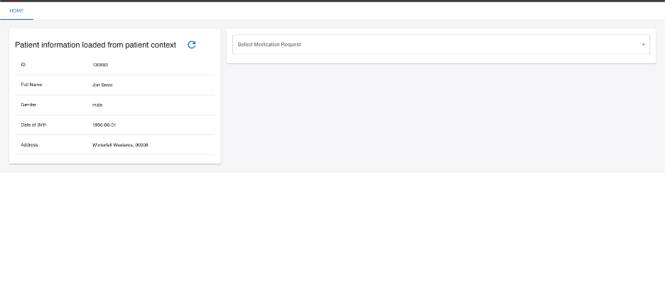

# Test Environment Usage

See [Test Environment Setup](TestEnvironmentSetup.md) for details on setting up the test environment.

### Using Meld

Navigate to https://meld.interop.community/REMS/apps to access the Meld  sandbox.  There are several things to be familiar with.

These are the registered apps.  A registered app consists of:
-	A launch URI, which is the actual SMART app
-	A redirect URI, which is a valid location for the SMART app to redirect
-	Scopes, which are the resources we have access to

After registering an app, we get a client id, which is the client id of the SMART app.

The SMART app must be made aware of the client id in order to launch correctly. In the case of the REMS SMART app, registration is handled at the time of launch if the app doesn’t already know which client id to use, which should make the process seamless.  

When launching an app, you are connecting it to Meld’s EHR system.
The data can be uploaded manually using the data manager as described in the [Test Environment Usage Document](TestEnvironmentSetup.md). Our default patient, Jon Snow, and all of his related resources should be loaded

For most purposes, Jon Snow will work just fine as our default patient.

When launching any app, Meld will ask you to select a persona.  Jon Snow’s resources all reference Rita Abrams, so ideally pick her as the practitioner when launching the REMS SMART app or request generator.

After selecting a practitioner, you can select a patient.  Selecting Jon Snow will properly allow the REMS SMART on FHIR app to function.  If you are launching the Request Generator, you can launch without a patient.

When asked to register a client, look under the settings for the registered app.  In this case, for the REMS SMART app, the client id is shown above.  

After submitting and retrying, the app will ask you to authorize.  Then it will launch the app.
 

The app should launch normally with the patient in context already.

### Logica Health 

Logica health operates in almost the exact same way as Meld.  It can be found at https://sandbox.logicahealth.org/CodeX/apps

You may run into an error trying to run the request generator. Launching the SMART app should work barring an error with the logica servers, which has happened from time to time.  

You can launch the SMART app normally, and go through the workflow.  The one currently available patient should have a Turalio medication request in their record.  
